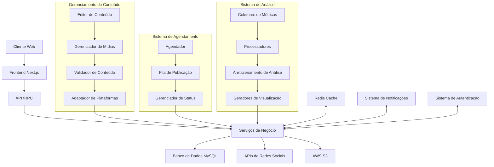
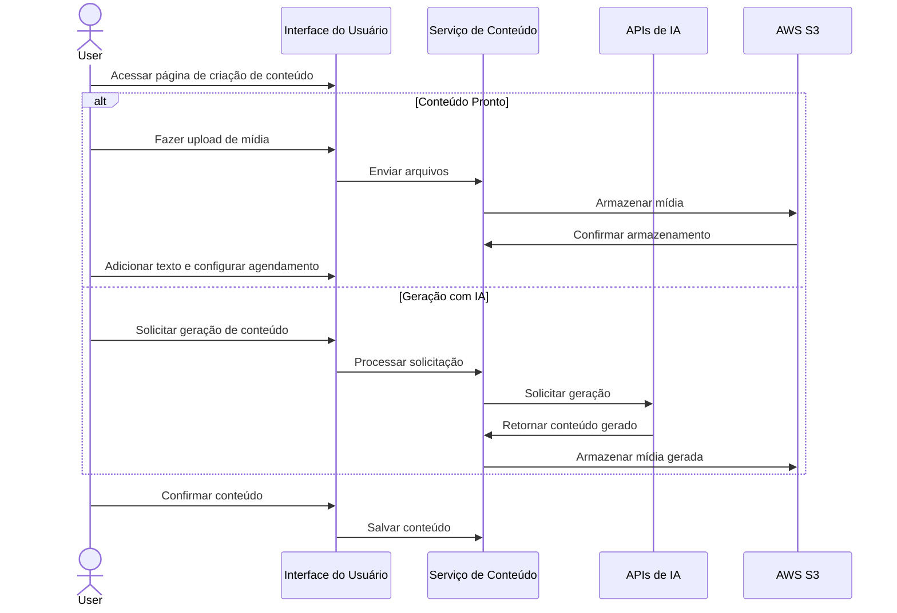
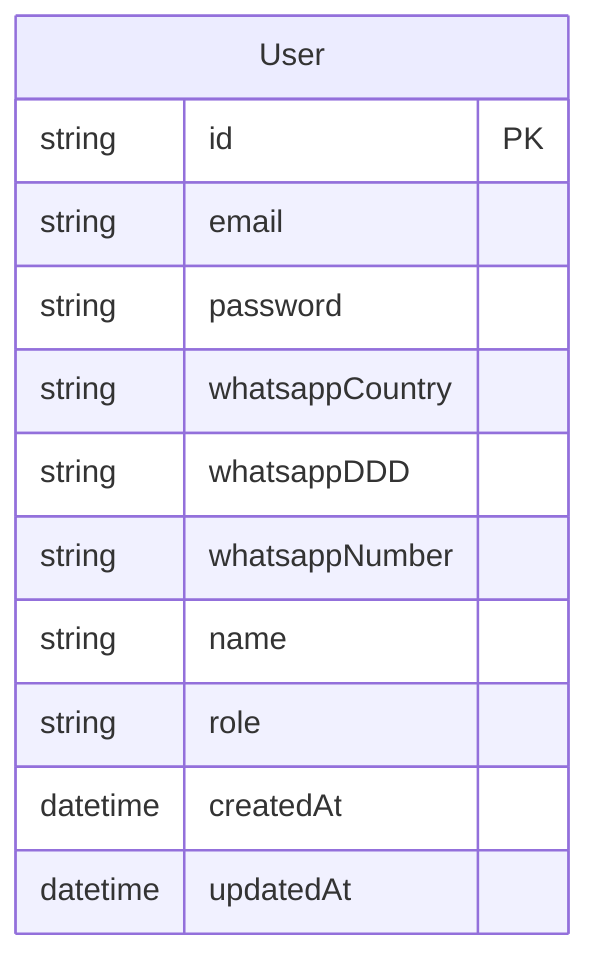

# PROJETO EXECUTIVO - POSTAX

> Este documento serve como fonte central de verdade e registro histórico de desenvolvimento do projeto. Cada nova etapa de desenvolvimento deve ser documentada como uma nova seção datada, sem modificar ou remover seções anteriores.

## Índice
1. [Visão Geral](#visão-geral)
2. [Stack Tecnológico](#stack-tecnológico)
3. [Arquitetura](#arquitetura)
4. [Estrutura do Projeto](#estrutura-do-projeto)
5. [Banco de Dados](#banco-de-dados)
6. [Autenticação e Autorização](#autenticação-e-autorização)
7. [APIs e Integrações](#apis-e-integrações)
8. [Responsividade e Design](#responsividade-e-design)
9. [Plano de Implementação](#plano-de-implementação)
10. [Documentação](#documentação)
11. [Glossário](#glossário)
12. [Histórico de Desenvolvimento](#histórico-de-desenvolvimento)

## Visão Geral

### Propósito do Projeto
O Postax é uma ferramenta para criação de conteúdo e agendamento automático de posts para redes sociais. O projeto resolve o problema da complexidade e tempo necessário para manter uma presença digital consistente, especialmente para usuários com baixo conhecimento técnico e empresas de pequeno e médio porte. O valor entregue é a simplificação do processo de criação e gerenciamento de conteúdo através de uma interface intuitiva, aumentando a eficiência e a qualidade da presença digital dos usuários.

### Objetivos
- Facilitar a criação de conteúdo de qualidade por usuários de nível baixo de conhecimento técnico
- Gerenciar Grupo de Trabalho por produção e resultado (desempenho do material gerado por usuário)
- Crescimento consistente da presença digital do usuário

### Requisitos Principais
- **Criação de Conteúdo**: 
  - a. Envio de Artes prontas (imagens ou vídeos), com título, descrição e data e hora de agendamento (pode ser imediato)
  - b. Criação de Conteúdo por IA
- **Aprovação de Conteúdo**: Usuários "parent" (padrão) terão uma seção exclusiva para aprovar os posts enviados (ou criados) pelos usuários do seu Grupo de Trabalho (usuários "child"), podendo enviar comentários e receber respostas dos comentários. Os comentários devem estar conectados ao sistema de notificação do site.
- **Redes Sociais**: Visão geral com desempenho em linha do tempo e gerenciamento de conexão das redes sociais
- **Grupos de Trabalho**: Gerenciamento do grupo de trabalho

### Público-alvo
O projeto é direcionado para criadores de conteúdo com baixo nível técnico e empresas de pequeno e médio porte que buscam melhorar seu posicionamento nas redes sociais. Estes usuários têm necessidades específicas de simplicidade na operação, eficiência na criação de conteúdo e capacidade de gerenciar equipes de forma eficaz.

### Sistema de Navegação
O sistema de navegação será convencional, com um menu de navegação lateral ou superior, proporcionando acesso claro e direto às diferentes funcionalidades da plataforma. A interface será intuitiva, focada em simplicidade e usabilidade, com um dashboard central para visualização rápida dos principais indicadores.

## Stack Tecnológico

### Frontend
- **Framework**: Next.js 14
- **Linguagem**: TypeScript 5
- **Estilização**: TailwindCSS, Shadcn/UI, Radix UI
- **Animações**: Framer Motion
- **Gerenciamento de Estado**: Context API, Zustand
- **Renderização**: App Router, Server Components

### Backend
- **Runtime**: Node.js 20.x
- **Framework**: Next.js API Routes, Express
- **API**: tRPC
- **Validação**: Zod

### Banco de Dados
- **Principal**: MySQL
- **Cache**: Redis
- **ORM**: Prisma
- **Migrations**: Prisma Migrate

### Infraestrutura
- **Ambiente de Desenvolvimento**: Windows 10
- **Ambiente de Produção**: AWS EC2
- **CI/CD**: GitHub Actions
- **Containerização**: Docker, Docker Compose
- **Storage**: AWS S3

### Ferramentas de Desenvolvimento
- **Linting/Formatting**: ESLint, Prettier
- **Testing**: Jest, React Testing Library, Playwright
- **Build**: Webpack, Turbopack
- **Package Manager**: pnpm

### Justificativas Técnicas
A escolha do stack tecnológico foi baseada na necessidade de criar uma aplicação moderna, escalável e de alta performance:

**Next.js com TypeScript**:
- Renderização híbrida para melhor SEO e performance
- App Router para organização de rotas e layouts
- API Routes para endpoints de API no mesmo projeto
- TypeScript para tipagem estática e melhor DX

**TailwindCSS, Shadcn/UI e Radix**:
- Desenvolvimento rápido sem mudar de contexto
- Componentes acessíveis e customizáveis
- Consistência visual e design system estabelecido
- Bundle size otimizado

**tRPC**:
- Type-safety end-to-end entre cliente e servidor
- Redução de boilerplate para definir e consumir APIs
- Integração perfeita com Zod para validação
- Melhor developer experience

**MySQL e Prisma**:
- Confiabilidade e facilidade de configuração do MySQL
- Prisma para modelagem type-safe e migrations
- Queries seguras e proteção contra SQL injection
- Facilidade de manutenção

**Docker e AWS EC2**:
- Consistência entre ambientes
- Isolamento de serviços
- Flexibilidade e controle da infraestrutura
- Escalabilidade conforme necessário

**AWS S3**:
- Armazenamento escalável para arquivos de mídia
- Alta disponibilidade e durabilidade
- Baixo custo com fácil integração
- Controle granular de permissões de acesso

**Redis**:
- Cache em memória para performance
- Suporte a diversos tipos de dados
- TTL nativo
- Possibilidade de implementar eventos em tempo real

## Arquitetura

### Visão Geral da Arquitetura
O Postax é construído como uma aplicação web moderna com navegação convencional. A arquitetura é estruturada em torno de um modelo cliente-servidor, onde o frontend em Next.js se comunica com o backend através de APIs tRPC. O backend processa as requisições e interage com o banco de dados MySQL e serviços de terceiros, como APIs de redes sociais (Facebook, Instagram) e serviços de armazenamento (AWS S3).

A aplicação seguirá uma estrutura modular, com componentes claramente separados para dashboard, gerenciamento de conteúdo, agendamento, métricas e configurações. Esta abordagem facilita a manutenção e a escalabilidade do sistema.

A arquitetura segue princípios de design orientado a domínio (DDD) com uma clara separação entre camadas de apresentação, aplicação, domínio e infraestrutura. As funcionalidades são organizadas em módulos de domínio coesos que encapsulam regras de negócio específicas.

### Diagrama de Arquitetura


### Fluxos Principais
1. **Criação de Conteúdo**: O usuário utiliza a interface para fazer upload de conteúdo pronto ou gerar conteúdo com ajuda de IA.



2. **Aprovação de Conteúdo**: Os usuários "parent" recebem notificações de novos conteúdos criados por seus usuários "child", podem revisar, comentar e aprovar.

3. **Agendamento**: Após a aprovação, o conteúdo é agendado para publicação na data e hora especificadas.

4. **Publicação**: O sistema publica automaticamente o conteúdo nas redes sociais configuradas.

5. **Análise de Métricas**: O sistema coleta e analisa métricas de desempenho, apresentando-as de forma visual no dashboard.

### Componentes do Sistema
1. **Interface de Usuário**: Dashboard, formulários de criação de conteúdo, visualizações de métricas.
2. **Gerenciador de Conteúdo**: Responsável pelo armazenamento, edição e organização do conteúdo.
3. **Integração com Redes Sociais**: Gerencia a autenticação e comunicação com APIs de redes sociais.
4. **Sistema de Agendamento**: Programa a publicação de conteúdo em datas e horários específicos.
5. **Sistema de Notificações**: Gerencia notificações internas para usuários.
6. **Sistema de Análise**: Coleta, processa e visualiza métricas de desempenho.
7. **Gerenciador de Grupos de Trabalho**: Controla relacionamentos e permissões entre usuários.

### Considerações de Segurança
A segurança é uma preocupação primordial, especialmente considerando que o sistema lida com acesso a contas de redes sociais dos usuários. Implementações seguirão as melhores práticas OWASP, incluindo:

#### Autenticação e Gerenciamento de Sessão
- Autenticação segura com email/senha usando bcrypt para hash
- Implementação de throttling de tentativas de login
- Tokens JWT com tempo de expiração curto para sessões ativas
- Refresh tokens com rotação para renovação de sessão segura
- Invalidação imediata de tokens em mudança de senha ou logout

#### Autorização e Controle de Acesso
- Autorização baseada em papéis (RBAC)
- Princípio do menor privilégio para todas as operações
- Verificações de autorização em todas as rotas protegidas
- Logs de acesso para ações administrativas e operações sensíveis

#### Proteção de Dados
- Armazenamento seguro de tokens de acesso às APIs com criptografia
- Rotação automática de tokens de acesso
- Sanitização de inputs 
- Validação de dados em todas as entradas de usuário
- Proteção contra injeção SQL
- Prevenção de XSS

#### Comunicação e Infraestrutura
- Comunicação criptografada (HTTPS) obrigatória
- Configuração de headers de segurança
- Uso de variáveis de ambiente para armazenar credenciais e segredos
- Separação clara entre ambientes de desenvolvimento, teste e produção

### Considerações de Escalabilidade
Embora o volume inicial seja relativamente baixo (100 usuários), a arquitetura é projetada para escalar horizontalmente. A containerização com Docker facilita a escalabilidade, permitindo adicionar mais instâncias conforme necessário. O uso de Redis para cache melhora a performance e reduz a carga no banco de dados principal.

## Estrutura do Projeto

### Diretórios Principais
```
postax/
├── src/
│   ├── app/              # Rotas e páginas (Next.js App Router)
│   │   ├── ui/           # Componentes de UI básicos
│   │   ├── dashboard/    # Componentes do dashboard
│   │   ├── metrics/      # Componentes de visualização de métricas
│   │   └── content/      # Componentes relacionados a conteúdo
│   ├── lib/              # Bibliotecas e utilitários
│   ├── hooks/            # React hooks customizados
│   ├── context/          # Contextos React
│   ├── services/         # Serviços e lógica de negócio
│   │   ├── social/       # Serviços de redes sociais
│   │   ├── metrics/      # Serviços de métricas
│   │   └── notifications/ # Serviços de notificações
│   ├── models/           # Modelos de dados e tipos
│   ├── styles/           # Estilos globais
│   └── utils/            # Funções utilitárias
├── public/               # Arquivos estáticos
├── prisma/               # Esquema do banco de dados
├── tests/                # Testes
├── scripts/              # Scripts utilitários
└── docs/                 # Documentação adicional
```

### Propósito dos Diretórios
- **app/**: Contém as rotas e páginas da aplicação utilizando o Next.js App Router.
- **components/**: Componentes React reutilizáveis organizados por domínio.
- **lib/**: Bibliotecas e utilitários, incluindo configurações de clientes HTTP, helpers de formato, etc.
- **hooks/**: Hooks React customizados para lógica reutilizável.
- **context/**: Contextos React para gerenciamento de estado global.
- **services/**: Serviços que encapsulam lógica de negócio e integrações externas.
- **models/**: Definições de tipos e interfaces TypeScript.
- **styles/**: Estilos globais e configurações de temas.
- **utils/**: Funções utilitárias para operações comuns.
- **prisma/**: Configuração e esquema do Prisma ORM.
- **tests/**: Testes automatizados (unitários, integração, e2e).
- **scripts/**: Scripts de utilidade para automação de tarefas.
- **docs/**: Documentação adicional do projeto.

### Convenções de Nomenclatura
- **Arquivos**: kebab-case para arquivos de componentes (ex: user-profile.tsx)
- **Componentes**: PascalCase para componentes React (ex: UserProfile)
- **Funções/Variáveis**: camelCase para funções e variáveis (ex: getUserData)
- **Constantes**: UPPER_SNAKE_CASE para constantes (ex: API_ENDPOINT)
- **Interfaces/Tipos**: PascalCase com prefixo I para interfaces (ex: IUser) e T para tipos (ex: TUserRole)
- **Contextos**: Sufixo Context para contextos React (ex: AuthContext)
- **Hooks**: Prefixo use para hooks (ex: useAuth)

### Padrões de Implementação
- **Component-First Development**: Desenvolvimento focado em componentes reutilizáveis e bem documentados.
- **Server Actions**: Utilização de Server Actions do Next.js para operações de servidor.
- **Feature-Driven Structure**: Organização do código por funcionalidade em vez de tipo de arquivo.
- **Type-Safe API Calls**: Uso de tRPC para chamadas de API type-safe.
- **Progressive Enhancement**: Garantir que a aplicação funcione mesmo com JavaScript desabilitado.
- **Mobile-First Design**: Design responsivo priorizando a experiência em dispositivos móveis.

## Banco de Dados

### Modelo de Dados
O modelo de dados do Postax será simplificado para focar apenas na entidade User inicialmente:

1. **Users**: Informações dos usuários do sistema

### Diagrama ER


### Detalhes do Modelo User
- **id**: Identificador único do usuário (UUID)
- **email**: Email do usuário (único)
- **password**: Senha do usuário (armazenada com hash)
- **whatsappCountry**: Código do país (+55 para Brasil)
- **whatsappDDD**: DDD do telefone (dois dígitos)
- **whatsappNumber**: Número do telefone (9 dígitos)
- **name**: Nome completo do usuário
- **role**: Papel do usuário no sistema (admin, parent, child)
- **createdAt**: Data e hora de criação do registro
- **updatedAt**: Data e hora da última atualização do registro

### Estratégia de Migração
A estratégia de migração será baseada no Prisma Migrate, que permite criar e aplicar migrações de forma declarativa. O fluxo de trabalho será:

1. Modificar o schema do Prisma
2. Gerar a migração com `prisma migrate dev`
3. Aplicar a migração em ambientes de teste
4. Após validação, aplicar em produção com `prisma migrate deploy`

Os scripts de migração serão versionados no repositório para garantir consistência entre ambientes.

### Configuração da Conexão com o Banco de Dados
Para configurar a conexão com o banco de dados MySQL, o desenvolvedor deverá fornecer as seguintes credenciais:

1. **Host**: Endereço do servidor MySQL
2. **Porta**: Porta do servidor MySQL (padrão: 3306)
3. **Nome do banco**: Nome do banco de dados
4. **Usuário**: Nome de usuário para conexão
5. **Senha**: Senha do usuário
6. **SSL**: Configuração de SSL (se necessário)

Estas credenciais serão armazenadas como variáveis de ambiente e utilizadas na string de conexão do Prisma.

## Autenticação e Autorização

### Fluxo de Autenticação
O sistema utilizará autenticação baseada em email/senha, com os seguintes passos:

1. Usuário insere email e senha no formulário de login
2. Sistema valida as credenciais contra o banco de dados
3. Se válidas, gera um token JWT com informações do usuário
4. Token é armazenado em um cookie HTTP-only
5. Validação do token em cada requisição

### Registro de Usuário
O formulário de registro incluirá os seguintes campos:
- **Nome Completo**: Nome do usuário
- **Email**: Email para autenticação
- **Senha**: Senha para autenticação
- **Confirmar Senha**: Verificação da senha
- **WhatsApp**:
  - **País**: Campo fixo (+55 para Brasil)
  - **DDD**: Select com todos os DDDs do Brasil (padrão: 11 para SP)
  - **Número**: Campo para o número (formato: 9 8888-7777)

### Gestão de Sessões
- Sessões serão gerenciadas por tokens JWT
- Tokens terão expiração de 24 horas
- Implementação de refresh tokens para renovação automática
- Invalidação de sessão ao alterar senha ou logout explícito

### Perfis e Permissões
O sistema terá os seguintes perfis de usuário:

1. **Admin**: Acesso total ao sistema, configurações globais e dashboard administrativo
2. **Parent**: Gerenciamento de grupos de trabalho, aprovação de conteúdo
3. **Child**: Criação de conteúdo, visualização de métricas próprias

As permissões serão baseadas em ações específicas:

- **CREATE_CONTENT**: Criar novo conteúdo
- **APPROVE_CONTENT**: Aprovar conteúdo para publicação
- **MANAGE_WORKGROUP**: Gerenciar membros do grupo de trabalho
- **VIEW_METRICS**: Visualizar métricas de desempenho
- **MANAGE_SOCIAL_ACCOUNTS**: Conectar/desconectar contas de redes sociais

### Segurança
- Senhas armazenadas com hash + salt (bcrypt)
- Implementação de rate limiting para evitar ataques de força bruta
- CSRF protection com tokens
- Headers de segurança (Content-Security-Policy, X-XSS-Protection)
- Verificação de email para ativação de conta

## APIs e Integrações

### APIs Internas
O sistema utilizará tRPC para a comunicação entre cliente e servidor, com os seguintes serviços principais:

1. **auth**: Autenticação e gerenciamento de usuários
2. **workgroups**: Gerenciamento de grupos de trabalho
3. **content**: Criação e gerenciamento de conteúdo
4. **scheduling**: Agendamento de publicações
5. **metrics**: Coleta e análise de métricas
6. **notifications**: Sistema de notificações

### Integrações Externas
O sistema integrará com as seguintes APIs externas:

1. **Facebook Graph API**: Para publicação e métricas do Facebook
2. **Instagram Graph API**: Para publicação e métricas do Instagram
3. **AWS S3**: Para armazenamento de mídias

### Configuração do AWS S3
Para a configuração do armazenamento AWS S3, o desenvolvedor deverá fornecer:

1. **Access Key ID**: Chave de acesso da AWS
2. **Secret Access Key**: Chave secreta da AWS
3. **Região**: Região onde o bucket está localizado
4. **Bucket Name**: Nome do bucket para armazenamento de mídias
5. **Endpoint**: Endpoint do S3 (se estiver usando um serviço compatível com S3)

Estas credenciais serão armazenadas como variáveis de ambiente e utilizadas para configurar o cliente S3.

### Contratos de API
Os contratos de API serão definidos através de schemas Zod para validação e TypeScript para tipagem. Cada endpoint terá:

- Parâmetros de entrada tipados e validados
- Resposta tipada
- Tratamento de erros consistente
- Documentação automática através do tRPC

### Estratégia de Versionamento
As APIs internas serão versionadas através do namespace do tRPC, seguindo o padrão semântico:

- **Major**: Mudanças incompatíveis que quebram a compatibilidade
- **Minor**: Adições de funcionalidades sem quebrar compatibilidade
- **Patch**: Correções de bugs sem alterar funcionalidades

Para APIs externas, adaptadores serão implementados para isolar mudanças e minimizar impacto no sistema.

## Responsividade e Design

### Princípios de Design
O Postax adotará uma abordagem "Mobile-First" com foco em acessibilidade e experiência do usuário consistente em todos os dispositivos. Os principais princípios incluem:

1. **Design Responsivo**: Interface adaptável a diferentes tamanhos de tela e orientações
2. **Acessibilidade (WCAG 2.1 AA)**: Suporte a tecnologias assistivas
3. **Consistência Visual**: Sistema de design coeso com componentes reutilizáveis
4. **Performance**: Otimização para carregar rapidamente mesmo em conexões lentas
5. **Navegação Intuitiva**: Estrutura clara e previsível para fácil utilização

### Implementação da Responsividade
A responsividade será implementada através de uma combinação de:

1. **TailwindCSS com Variantes Responsivas**
2. **Container Queries**
3. **Componentes Adaptativos**

### Sistema de Design e Componentes
O sistema de design do Postax será construído sobre o Shadcn/UI, estendido com componentes customizados:

1. **Tokens de Design**: Cores, espaçamentos, tipografia, sombras, etc.
2. **Estilização Consistente**: Padrões visuais uniformes usando Tailwind e CSS Modules
3. **Biblioteca de Componentes**: Conjunto reutilizável para aumentar velocidade de desenvolvimento

### Diretrizes de Acessibilidade
Para garantir que o Postax seja acessível para todos os usuários, serão implementadas as seguintes práticas:

1. **Semântica HTML**: Uso apropriado de elementos e atributos HTML
2. **Gerenciamento de Foco**: Navegação por teclado e foco visível
3. **Contraste de Cores**: Garantir legibilidade com contraste adequado
4. **Textos Alternativos**: Descrições para elementos visuais
5. **Mensagens de Erro**: Feedback claro e instruções para correção

## Plano de Implementação

### Fases do Projeto
O projeto será implementado em fases incrementais:

1. **Fase 1 - MVP**:
   - **Tarefas**:
     - Configuração inicial do projeto
     - Implementação do sistema de autenticação (registro/login)
     - Criação do dashboard principal
     - Desenvolvimento do módulo de conexão com redes sociais
     - Implementação do sistema de upload de mídias para S3
     - Desenvolvimento do módulo de agendamento de posts
     - Implementação da publicação imediata vs. agendada
     - Testes e validação do MVP

2. **Fase 2 - Criação de Conteúdo**:
   - **Tarefas**:
     - Desenvolvimento do editor de conteúdo
     - Expansão das opções de personalização
     - Implementação do preview antes da publicação
     - Sistema de armazenamento de rascunhos
     - Integração com bibliotecas de imagens stock
     - Implementação do histórico de conteúdo
     - Testes de usabilidade e ajustes

3. **Fase 3 - Análise de Métricas**:
   - **Tarefas**:
     - Desenvolvimento da infraestrutura de coleta de dados
     - Implementação dos coletores para cada rede social
     - Criação do armazenamento de métricas
     - Desenvolvimento de dashboards por plataforma
     - Implementação de relatórios comparativos
     - Visualizações interativas de desempenho
     - Testes de performance e ajustes

4. **Fase 4 - Funcionalidades Avançadas**:
   - **Tarefas**:
     - Implementação do sistema de permissões e papéis
     - Desenvolvimento do módulo de grupos de trabalho
     - Implementação do fluxo de aprovação de conteúdo
     - Sistema de notificações internas
     - Implementação de webhooks para integrações
     - Criação de APIs para integração externa
     - Testes de segurança e escalabilidade

### Dependências entre Componentes
- Sistema de autenticação deve ser implementado antes dos outros componentes
- Integração com AWS S3 é pré-requisito para o upload de mídias
- Integração com redes sociais é pré-requisito para o sistema de agendamento
- Coleta de métricas depende da integração com redes sociais

## Documentação

### Estratégia de Documentação

A documentação do Postax será abrangente e mantida como parte integrante do processo de desenvolvimento. Seguiremos uma abordagem de "Documentação como Código", tratando os documentos como artefatos de primeira classe no processo de desenvolvimento.

#### Tipos de Documentação

1. **Documentação de Projeto**
   - **Projeto Executivo (este documento)**: Fonte central de verdade sobre o projeto
   - **README.md**: Visão geral, instruções de instalação e uso básico
   - **ARCHITECTURE.md**: Detalhes específicos da arquitetura
   - **CHANGELOG.md**: Registro de alterações por versão

2. **Documentação Técnica**
   - **API Docs**: Documentação automática gerada a partir do tRPC
   - **Storybook**: Documentação interativa de componentes UI
   - **JSDocs/TSdocs**: Documentação inline para classes, funções e interfaces
   - **Database Schema**: Visualização e documentação do esquema do banco

3. **Documentação de Processos**
   - **CONTRIBUTING.md**: Guia para novos contribuidores
   - **CODE_OF_CONDUCT.md**: Diretrizes de comportamento
   - **SECURITY.md**: Políticas e procedimentos de segurança
   - **DEPLOYMENT.md**: Processo de deploy e CI/CD

4. **Documentação de Usuário**
   - **Guia de Usuário**: Manual completo do usuário final
   - **Tutoriais**: Guias passo-a-passo para tarefas comuns
   - **FAQ**: Perguntas frequentes
   - **Tooltips e Ajuda Contextual**: Documentação dentro da aplicação

#### Princípios de Documentação

1. **Documentação como Código**
   - Versionada no mesmo repositório que o código
   - Sujeita aos mesmos processos de revisão
   - Atualizada como parte do desenvolvimento de features

2. **Manter Atualizada**
   - Revisão da documentação como parte do DoD (Definition of Done)
   - Automation para detectar documentação desatualizada
   - Processo de atualização contínua

3. **Estrutura Consistente**
   - Templates padronizados para cada tipo de documento
   - Formatação e estilo consistentes
   - Nomenclatura clara e previsível

4. **Acessibilidade**
   - Linguagem clara e concisa
   - Organização lógica com boa navegação
   - Uso de diagramas e exemplos

#### Ferramentas de Documentação

1. **Markdown para Documentação Textual**
   - Fácil de escrever e manter
   - Renderização em GitHub/GitLab
   - Conversão para outros formatos quando necessário

2. **Mermaid para Diagramas**
   - Diagramas como código
   - Versionáveis e mantidos junto com o código
   - Fácil atualização e consistência

3. **Storybook para Componentes**
   - Documentação viva dos componentes UI
   - Testes visuais integrados
   - Exemplos interativos

4. **Docusaurus para Documentação Técnica**
   - Site de documentação completo
   - Versionamento de docs
   - Pesquisa integrada

#### Histórico de Desenvolvimento
Para cada fase do projeto, será criado um documento de histórico específico que registrará:

1. **O que foi implementado**: Detalhes sobre as funcionalidades desenvolvidas
2. **Como foi implementado**: Descrição da abordagem técnica
3. **Decisões tomadas**: Justificativas para escolhas de design e implementação
4. **Desafios e soluções**: Problemas encontrados e como foram resolvidos
5. **Conexões com outros componentes**: Integração com partes existentes do sistema
6. **Considerações futuras**: Melhorias planejadas e pontos de atenção

Estes documentos serão armazenados na pasta `/docs/historico` e nomeados seguindo o padrão `AAAA-MM-DD_fase-X_resumo.md`.

#### Processo de Atualização da Documentação

A documentação do Postax seguirá um processo claro de atualização para garantir que permaneça atual e útil:

1. **Para Novas Features**:
   - Documentação técnica escrita durante o desenvolvimento
   - Revisão da documentação parte do PR review
   - Atualização do CHANGELOG.md

2. **Para Mudanças Arquiteturais**:
   - Atualização do Projeto Executivo com nova entrada no histórico
   - Diagramas atualizados
   - Documentação das decisões e motivações

3. **Para Correções de Bug**:
   - Documentação do problema e solução
   - Atualização de guias afetados
   - Nota no CHANGELOG.md

4. **Para Releases**:
   - Consolidação das mudanças no CHANGELOG.md
   - Atualização da documentação de usuário
   - Verificação de consistência em toda a documentação

## Glossário

| Termo | Definição |
|-------|-----------|
| Usuário Parent | Usuário gerente que pode aprovar conteúdo e gerenciar um grupo de trabalho |
| Usuário Child | Usuário membro de um grupo de trabalho que cria conteúdo para aprovação |
| Grupo de Trabalho | Estrutura organizacional que conecta usuários parent e child |
| Dashboard | Interface principal que apresenta métricas e acesso às funcionalidades |
| Post | Conteúdo agendado para publicação em uma rede social |
| Métricas | Dados de desempenho coletados das redes sociais |
| Token API | Credencial que permite acesso às APIs de redes sociais |

## Histórico de Desenvolvimento

### 01/04/2024 - Sistema de Autenticação Implementado

O sistema de autenticação do Postax foi implementado com sucesso, conforme planejado na Fase 1 do projeto. As funcionalidades de registro, login e autorização estão operacionais, permitindo aos usuários criar contas, acessar o dashboard e utilizar os recursos protegidos do sistema.

#### Implementações Concluídas:
- **Registro de usuários**: Formulário completo com validação de campos, incluindo formatação de WhatsApp
- **Login com email/senha**: Autenticação segura utilizando NextAuth.js
- **Sessões baseadas em JWT**: Gerenciamento de estado de autenticação do usuário
- **Proteção de rotas**: Redirecionamento automático para login quando usuário não está autenticado
- **Dashboard inicial**: Interface básica com layout responsivo após autenticação

#### Desafios Superados:
1. **Compatibilidade com a estrutura do banco de dados**: A implementação foi adaptada para trabalhar com a estrutura existente do banco de dados MySQL. Os desafios incluíram:
   - Sensibilidade a maiúsculas/minúsculas no nome da tabela (`users` vs `Users`)
   - Ausência de soft deletion (`deleted_at`)
   - Formato diferente para armazenamento do WhatsApp (campo único vs campos separados)

2. **Validação consistente**: Implementação de schemas Zod para validação client e server-side, garantindo dados consistentes e feedback claro de erros ao usuário.

3. **Conexão com AWS RDS**: Configuração apropriada da conexão com banco de dados remoto, incluindo SSL e parsing da URL de conexão.

#### Próximos Passos:
- Implementação do sistema de recuperação de senha
- Adição de provedores de autenticação social (Google, Facebook)
- Expansão do perfil de usuário com mais campos e preferências
- Implementação das funcionalidades de edição de perfil

#### Decisões tomadas
- Mudança para navegação convencional para simplificar o desenvolvimento inicial
- Simplificação do modelo de dados, mantendo apenas a tabela User
- Mudança do banco de dados de PostgreSQL para MySQL
- Adoção do AWS S3 para armazenamento de mídias
- Reestruturação das fases de implementação com tarefas específicas para cada fase

#### Desafios e soluções
- **Desafio**: Simplificar a arquitetura mantendo a escalabilidade
  **Solução**: Adoção de uma arquitetura modular com componentes independentes

- **Desafio**: Adaptação do sistema de autenticação para o novo modelo
  **Solução**: Implementação de um sistema de login/registro convencional com campos específicos para WhatsApp

- **Desafio**: Garantir a segurança no armazenamento e processamento de mídias
  **Solução**: Utilização do AWS S3 com políticas de acesso restritas e tokens de URL temporários

#### Conexões com outros componentes
A simplificação da arquitetura mantém as conexões essenciais entre:
- Frontend e Backend através da arquitetura tRPC
- Sistema de autenticação e gerenciamento de permissões
- Mecanismo de upload/armazenamento e sistema de agendamento
- Integração com redes sociais e módulo de publicação

#### Considerações futuras
- Implementação gradual das entidades de banco de dados conforme necessidade
- Expansão do sistema de autenticação para incluir login social
- Desenvolvimento de APIs públicas para integrações externas
- Melhoria contínua da experiência do usuário com base em feedback

### [28/03/2025] - Definição Inicial do Projeto

#### O que foi implementado
Nesta etapa foi realizada a definição inicial do projeto Postax, incluindo a documentação do propósito, objetivos, requisitos, arquitetura e plano de implementação.

#### Como foi implementado
A definição foi criada com base em um processo estruturado de levantamento de requisitos, culminando na documentação detalhada no Projeto Executivo.

#### Decisões tomadas
- Adoção de uma interface conversacional como núcleo da aplicação
- Integração com Facebook e Instagram inicialmente, deixando outras redes para fases futuras
- Implementação de sistema de grupos de trabalho com hierarquia parent-child
- Escolha do stack tecnológico baseado em Next.js, TypeScript, TailwindCSS, tRPC e PostgreSQL

#### Desafios e soluções
- **Desafio**: Criar uma interface conversacional eficiente que possa acionar diferentes funcionalidades
  **Solução**: Integração com OpenAI API para interpretar intenções e acionar funções específicas

- **Desafio**: Gerenciar várias contas de redes sociais de forma segura
  **Solução**: Implementação de sistema de armazenamento seguro de tokens e permissões granulares

#### Considerações futuras
- Implementação de análise automática para sugestão de melhores horários de publicação
- Expansão para outras redes sociais além de Facebook e Instagram
- Desenvolvimento de insights cruzando diferentes métricas de desempenho
- Implementação de webhooks para integrações externas

#### Diagramas atualizados
Os diagramas de arquitetura e do modelo de dados foram criados para refletir a estrutura inicial planejada para o sistema.

## Estado Atual do Desenvolvimento

### Sistema de Autenticação e Dashboard Inicial (2023-11-24)

#### Implementação Atual
Implementamos o sistema de autenticação e dashboard inicial utilizando Next.js e NextAuth.js com as seguintes funcionalidades:

1. **Componentes de UI**:
   - Criação dos componentes básicos (`Button`, `Input`, `Label`)
   - Implementação dos formulários de login e registro
   - Design alinhado com a identidade visual do Postax

2. **Backend**:
   - Configuração do NextAuth.js com provider de credenciais
   - Integração com banco de dados MySQL
   - API para registro de novos usuários
   - Validação de dados com Zod

3. **Segurança**:
   - Hash de senhas com bcrypt
   - Validação de dados com schemas Zod
   - Estratégia de JWT para sessões

4. **Dashboard e Configurações**:
   - Layout com navegação lateral
   - Página inicial do dashboard com resumo e primeiros passos
   - Seção de configurações do usuário
   - Formulários para edição de perfil e alteração de senha

#### Funcionalidades Implementadas
- Login de usuários com email e senha
- Registro de novos usuários com validação
- Persistência de sessão
- Mensagens de erro personalizadas
- Redirecionamento após autenticação
- Validação de dados tanto no frontend quanto no backend
- Dashboard inicial com métricas e orientações
- Edição de informações de perfil
- Alteração de senha

### Landing Page e Melhorias no Sistema de Autenticação (2024-05-03)

#### Implementação Atual
Implementamos uma landing page moderna e responsiva e realizamos ajustes no sistema de autenticação:

1. **Landing Page**:
   - Criação de uma página inicial atraente com design moderno
   - Implementação de seções: hero, recursos, CTA e footer
   - Design responsivo com gradientes, animações e layout em grid
   - Redirecionamento automático para dashboard para usuários autenticados

2. **Melhorias no Sistema de Autenticação**:
   - Correção de bugs relacionados à sensibilidade de case em nomes de tabelas
   - Adaptação para a estrutura real do banco de dados
   - Melhoria na validação de formulários
   - Resolução de problemas com erros de tipagem TypeScript

3. **Ajustes Técnicos**:
   - Atualização da configuração de metadados para Next.js 14
   - Correção de problemas estruturais em componentes de servidor
   - Melhoria na experiência do usuário nos formulários de registro

4. **Documentação**:
   - Atualização da documentação da Fase 1 com as novas implementações
   - Inclusão de desafios encontrados e soluções aplicadas
   - Adição de considerações para futuras extensões

#### Funcionalidades Implementadas
- Landing page com design moderno e responsivo
- Apresentação visual dos recursos principais da plataforma
- Melhoria na experiência de onboarding de novos usuários
- Ajustes no sistema de autenticação para maior robustez
- Conformidade com as novas diretrizes do Next.js 14

#### Próximos Passos
1. Desenvolver a funcionalidade de conectar redes sociais
2. Implementar o módulo de criação de conteúdo
3. Desenvolver o sistema de agendamento de posts
4. Implementar a estrutura de permissões para diferentes tipos de usuário
5. Adicionar análise de eventos para medir a taxa de conversão da landing page